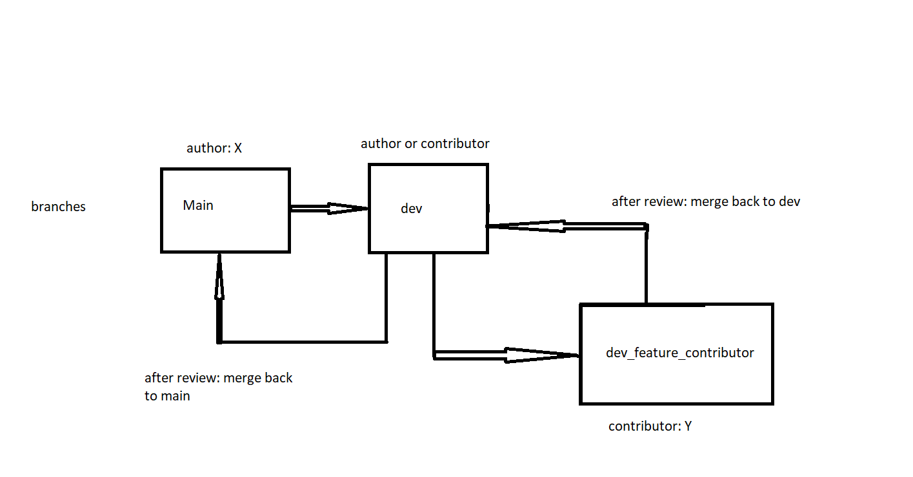
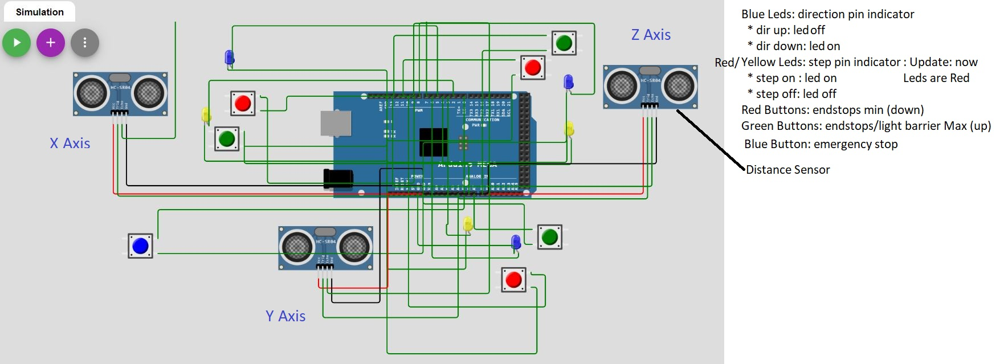
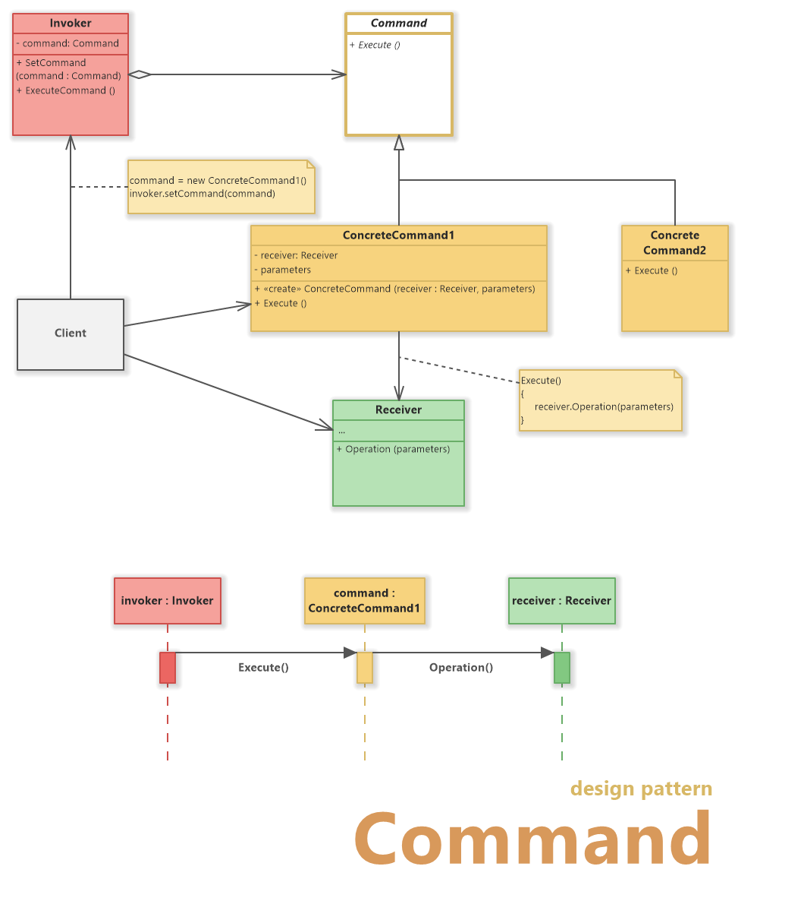
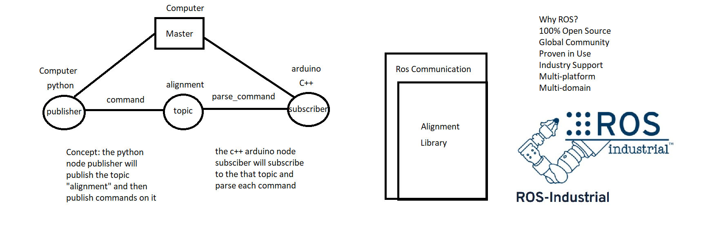

# Firmware Design Template
An object oriented firmware design Template in c++ used for embedded systems. Currently support arduinos (Uno, Mega, Due...). The Concept can be ported for Esp family and other mcu that supports c++ and the standard library implementation. 

# Contributon and Policy
* **First Rule**: Do not touch the main branch unless you are the author  
* **Second Rule**: if you wish to contribute, create a derived branch from dev with your feature and name: dev_feature_name
* **Third Rule**: understand the graph below: 

 

* **Author**: sami dhiab  
Contact: sami@theion.de

# API doc
The API doc is auto generated with doxygen.
click [docs](https://theionsami.github.io/firmware_design_template/), then Under Classes and Files you find the full API.
If you make a fork from this repo, dont forget to run doxygen from inside docs/ after any changes made to src/ inc/ or.md files and push!
even better run the [script](push.bat) and it will takes care:
~~~powershell
.\push #execute script push.bat
~~~

# Configuration File
In the configuration [file](include/Configs.h)  you need to define all required parameters:

- PINS: pinout related to respective mcu
- MACROS: DEBUG, VIRTUAL ,RELEASE or TEST
- ENUMERATION: return values

# Simulation & Virtualization
To develop the firmware and test it in complete isolation from the hardware, a virtualisation platform is used called [wokwi](https://wokwi.com/).
This provide a way to simulate a logic, algorithm or even some of the supported hardware (leds, sonar sensors, buttons, motors ...). Here is an example with arduino mega and connection with hardware.
 

# Command Design Pattern

The Device or the mcu (SLave or listener) will wait for commands to parse from the server or master side. unless there are some background functions that run independantly from coming commands, the main task is to parse the commands. 
To be able to parse commands in a proper way, these commands must be defined inside classes, the receivers of commands are objects (sensors, actuators) that receive commands, invokers are entity that make indirect request via command to a receiver 
(internal controller ). The client is the app running.
If we siimplify with an light switch example here: 
- Receiver: Light
- Command: turnOn, TurnOff
- Invoker: light Switch
 
# Communication protocol: Definiton of messages and return values
In many cases the master sending commands via Stream has to know the return of these Commands (if succes or fail) to process with next commands.
Example of Commands and their return Value: retVal represents an enumeration that has ok=0 or err=1 which corresponds respectvly to succes and failure of that command.

| message        | action           | return value  |  return type  |
| ------------- |:-------------:| ------------------:|------------------:|
| get uuid | get device uuid | uuid   |  String
| get motor x direction | return motor x direction |   direction |  String
| set motor y delay <value\> | set motor y delay value to    |   null |   retVal
| move z up <value\> | move up z to value     |   null |   retVal
| undo | execute last cmd    |   depends on last cmd |   depends on last cmd
| reset | reset device    |   null |   void
| sleep | sleep device    |   null |   void

It is up to to specify if <value\> can int, float, double or any type ..

# Demonstrartion Video
A demo value is coming soon..
# UML Class Diagramm
Under [UML](docs/uml/) folder are previous uml Diagrams.
# UML state Diagram
Deprecated.  see [UML](docs/uml/) folder for previous uml Diagrams.
# UML Sequence Diagram
see [UML](docs/uml/) folder for previous uml Diagrams.
# Test
please refer to test folder [readme](test/README.md) for tests and definitions.
Unit tests are found under same folder. follow this [link](https://docs.platformio.org/en/stable//advanced/unit-testing/index.html) for more infos.

# V3 Features
- implementing cmd design pattern
- implementing threading/scheduling tasks
- generating docsumentation fully with doxygen
# Change Log 
- 03.06.2022: tested 2 libraries for tasks scheduling
- before 19.05.2022: see older branch (master branch for change log)

# ROS Concept & Integration
For upcoming version, ros will be fully supported.
 

# TODO
- finish implementing scheduler
- finish docs for all files

# Concept and Limitations
Normally, commands are processed one after another (queue).
To parallize commands, either commands callbacks must be non blocking or if blocking ( loops) then yield() must be injected inside loop. using yield() can pause current command and resume where it left.
- example: injecting yield() inside 2 loops:
~~~cpp
void switchA()
 { 
  static int idx=0;
  for (idx=0; idx<100; idx++)
  {    
  Serial.print("counter A: ");
  Serial.println(idx);
  Serial.println("switching contextA");
  }    
 }
 void switchB() 
 {
  static int index=0;
  for (index=0; index<100; index++)
  {
  Serial.print("counter B: ");
  Serial.println(index);
  Serial.println("switching contextB");
  }    
 }
  
output:
counter A: 0
switching contextA
counter B: 0
switching contextB
~~~

- Using scheduler/threading on one core mcu like arduino:
like previous example, three scheduling libraries(task scheduling, arduino threads, AceRoutine) were tested to achieve this behavior. every library implementation has it own branch.
All of these libraries provide a high level concept to organise tasks, to avoid using delay() or millis() for time handling and can switch context(yield) between tasks.
The missing feature is the ability to add the context switching on top of the ready written code ( without modifying the existing code).

