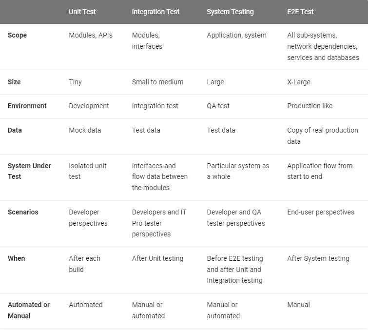
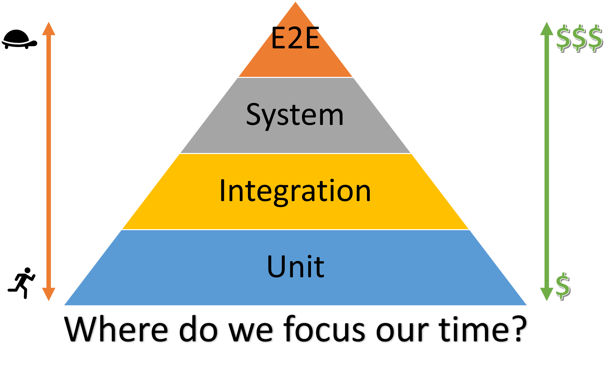

## Test
microsoft testing Framework:

 

follow [source](https://microsoft.github.io/code-with-engineering-playbook/) for more informations.
## Unit Test
Unit testing is a fundamental tool in every developer's toolbox. Unit tests not only help us test our code, they encourage good design practices, reduce the chances of bugs reaching production, and can even serve as examples or documentation on how code functions. Properly written unit tests can also improve developer efficiency.
Unit testing also is one of the most commonly misunderstood forms of testing. Unit testing refers to a very specific type of testing; a unit test should be:

* Provably reliable - should be 100% reliable so failures indicate a bug in the code
* Fast - should run in milliseconds, a whole unit testing suite shouldn't take longer than a couple seconds
* Isolated - removing all external dependencies ensures reliability and speed

## Integration Test
Integration testing is a software testing methodology used to determine how well individually developed components, or modules of a system communicate with each other. This method of testing confirms that an aggregate of a system, or sub-system, works together correctly or otherwise exposes erroneous behavior between two or more units of code.

## System Test

System testing is a combination of both functional and non-functional testing.

* Functional test: comes under System testing (which checks the overall end to end flow of an application).
* non-functional test: evaluate the non functional parts such as performance, load, stress, volume, usability(userfriendliness), look and feel etc.

## E2E Test

End-to-end (E2E) testing is a Software testing methodology to test a functional and data application flow consisting of several sub-systems working together from start to end.

At times, these systems are developed in different technologies by different teams or organizations. Finally, they come together to form a functional business application. Hence, testing a single system would not suffice. Therefore, end-to-end testing verifies the application from start to end putting all its components together.

